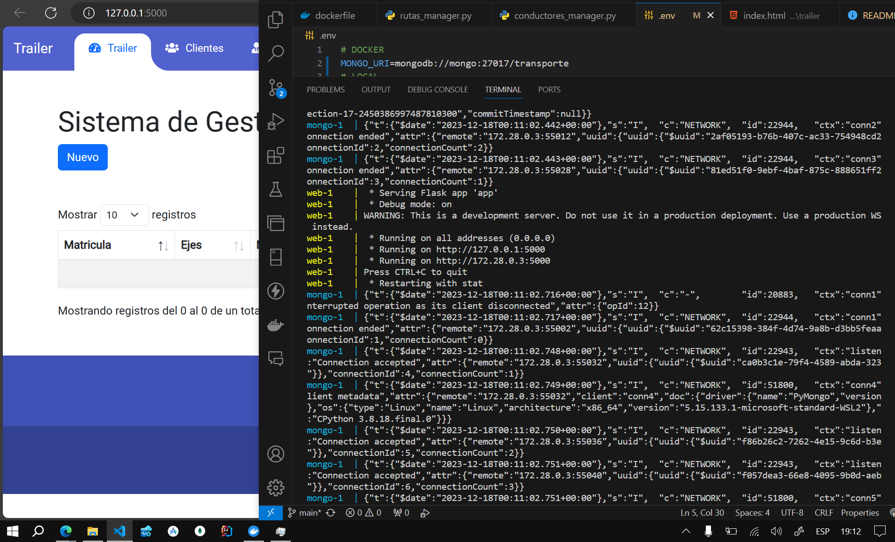
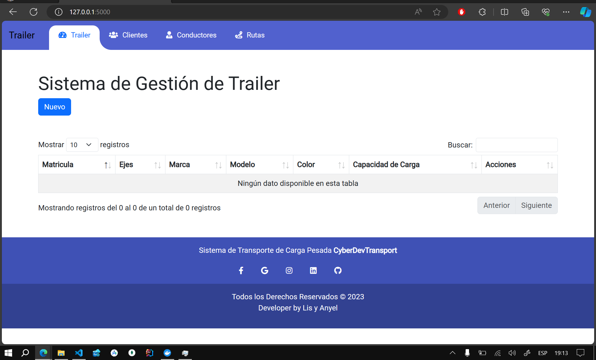
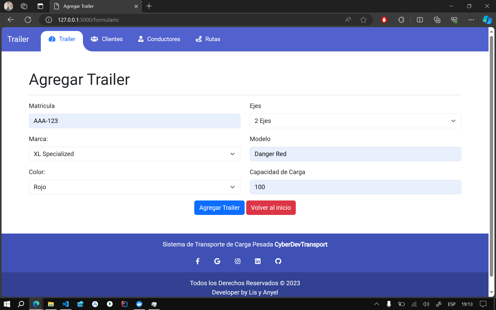
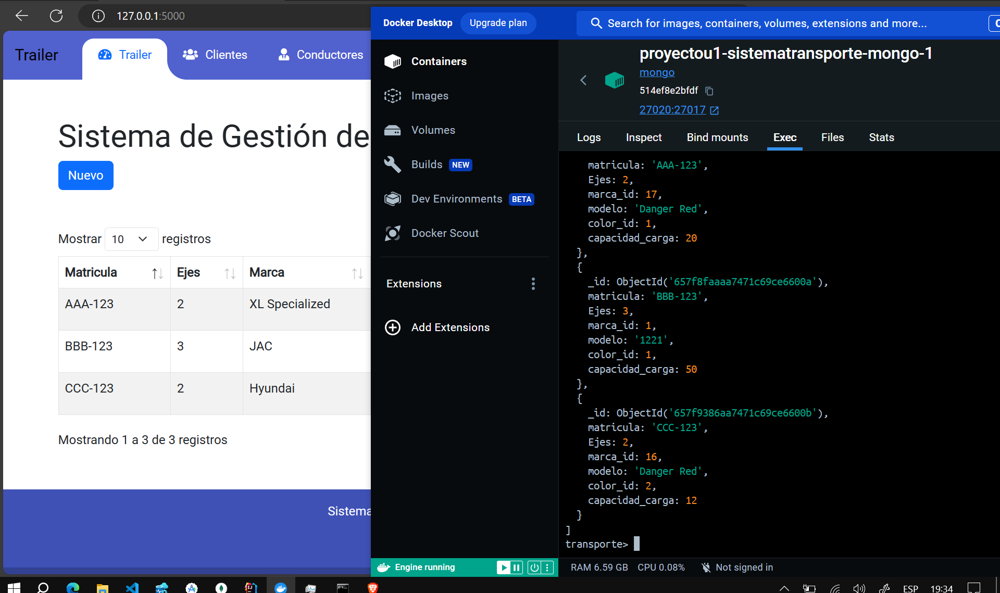
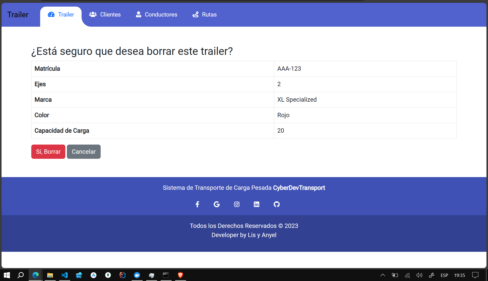

## Heavy Cargo Transport System Project

This project implements a heavy cargo transport system using technologies such as Docker, Flask, and MongoDB. The system provides functionalities for managing trailers, clients, drivers, and routes. Below is a brief guide to configure and run the project.

### Prerequisites
- Docker
- Python 3.8

### **Select Language:**
- [Español (Spanish)](README-es.md)
- [English](README.md)

## Result
### Start Web Service (Python-Flask) and MongoDB
 
### Home
 
### Add

### Add Data
 
### List Data in Docker
 
### Update
 
### Delete
 
### Container
 

### Environment Configuration

1. Create a `.env` file at the project's root and configure the necessary environment variables. Here's an example:

    ```env
    # DOCKER
    MONGO_URI=mongodb://mongo:27017/transporte
    # LOCAL
    # MONGO_URI=mongodb://localhost:27017/proyecto
    SECRET_KEY=secret_key_here
    ```

2. Make sure you have the `requirements.txt` file with the necessary dependencies for the project.

### Docker Configuration

The project uses Docker for container management. Below is an example of the `docker-compose.yml` file:

```yaml
version: '3'
services:
  web:
    build: .
    ports:
      - "5000:5000"
    depends_on:
      - mongo
    env_file:
      - .env
    
  mongo:
    image: mongo
    ports:
      - "27020:27017"
    volumes:
      - type: bind
        source: ./data
        target: /data/db
```

### Project Execution

1. Build and run the containers with Docker Compose:

    ```bash
    docker-compose up --build
    ```

2. Access the application at [http://localhost:5000](http://localhost:5000).
3. Access in Local Machine `mongosh mongodb://localhost:27020/transporte`
### Main Functionalities

- **Trailer:**
  - HOME: `/`
  - FORM ADD trailer: `/formulario`
  - ADD trailer: `/agregar`
  - UPDATE trailer: `/editar/<trailer_id>`
  - Eliminar trailer: `/eliminar/<trailer_id>`

- **Cliente:**
  - HOME: `/cliente/`
  - FORM ADD cliente: `/cliente/formulario`
  - ADD cliente: `/cliente/agregar`
  - UPDATE cliente: `/cliente/editar/<cliente_id>`
  - DELETE cliente: `/cliente/eliminar/<cliente_id>`

- **Conductor:**
  - HOME: `/conductor/`
  - FORM ADD conductor: `/conductor/formulario`
  - ADD conductor: `/conductor/agregar`
  - UPDATE conductor: `/conductor/editar/<conductor_id>`
  - DELETE conductor: `/conductor/eliminar/<conductor_id>`

- **Rutas:**
  - HOME: `/rutas/`
  - FORM ADD ruta: `/rutas/formulario`
  - ADD ruta: `/rutas/agregar`
  - UPDATE ruta: `/rutas/editar/<ruta_id>`
  - DELETE ruta: `/rutas/eliminar/<ruta_id>`

### MongoDB Connection Test

- You can perform a MongoDB connection test by accessing the route: `/test_mongo_connection`


